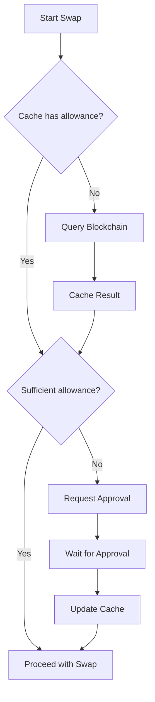

# Allowance Cache System

## Overview

The allowance cache system has been implemented to optimize swap operations by avoiding unnecessary blockchain queries to check approvals for previously approved tokens.

## Problem Solved

### Before (without cache):
- ❌ Each swap checked allowance on the blockchain
- ❌ Unnecessary delays for already approved tokens
- ❌ Higher computational and network costs
- ❌ Poor UX due to redundant verifications

### After (with cache):
- ✅ Instant verification for cached allowances
- ✅ Blockchain queries only when necessary
- ✅ Significantly improved performance
- ✅ Smoother and more responsive UX

## Architecture

### 1. Cache Service (`allowanceCache.js`)

**Location:** `src/services/allowanceCache.js`

**Main functionalities:**
- In-memory cache with TTL (Time To Live)
- Automatic cleanup of expired entries
- Eviction of old entries when necessary
- Cache key normalization
- Detailed logging for debugging

**Default configurations:**
```javascript
defaultTTL: 5 * 60 * 1000,      // 5 minutes for normal allowances
maxAllowanceTTL: 30 * 60 * 1000, // 30 minutes for MaxUint256
maxCacheSize: 1000,              // Maximum 1000 entries
cleanupInterval: 60 * 1000       // Cleanup every 1 minute
```

### 2. React Hook (`useAllowanceCache.js`)

**Location:** `src/hooks/useAllowanceCache.js`

**Available methods:**
- `checkAllowance()` - Quick cache verification
- `fetchAllowance()` - Blockchain fetch + cache
- `approveToken()` - Approval + cache update
- `isApprovalNeeded()` - Check if approval is needed
- `invalidateCache()` - Remove specific entry
- `clearCache()` - Clear entire cache

### 3. Service Integration

**Updated files:**
- `src/services/approvalServices.js`
- `src/services/aggregatorService.js`

**Integration points:**
- Verification before each swap
- Cache after successful approvals
- Invalidation on error

## Operation Flow

### 1. Allowance Verification



### 2. Cache Key Generation

Key format: `{userAddress}_{tokenAddress}_{spenderAddress}`

Example:
```javascript
"0xf59de020d650e69ef0755bf37f3d16b80ee132f5_0xcf664087a5bb0237a0bad6742852ec6c8d69a27a_0x1ff749824d4086c91cae24175860a95fbdcfee24"
```

### 3. TTL Strategy

| Approval Type | TTL | Rationale |
|--------------|-----|-----------|
| Specific Allowance | 5 minutes | Can be consumed quickly |
| MaxUint256 | 30 minutes | Very high value, rarely consumed |
| Verification Error | Immediate | Force new verification |

## Cache Structure

### Cache Entry Format

```javascript
{
  allowance: "115792089237316195423570985008687907853269984665640564039457584007913129639935", // BigInt as string
  expiration: 1703123456789, // Expiration timestamp
  timestamp: 1703123456789   // Creation timestamp
}
```

### Cache Statistics

```javascript
{
  totalEntries: 150,     // Total entries
  expiredEntries: 5,     // Expired entries
  activeEntries: 145,    // Active entries
  maxSize: 1000,         // Maximum size
  defaultTTL: 300000     // Default TTL in ms
}
```

## Debugging and Monitoring

### 1. Debug Component

**Location:** `src/components/AllowanceCacheDebug.jsx`

**Features:**
- Real-time statistics
- Cache hit rate
- Manual cache cleanup
- Visible only in development

**How to enable:**
```bash
# Via environment variable
VITE_ENABLE_DEBUG_LOGS=true

# Or force in component
<AllowanceCacheDebug enabled={true} />
```

### 2. Console Logs

The system produces detailed logs:

```javascript
[AllowanceCache] Initialized with TTL: 300000 ms
[AllowanceCache] Cache hit for 0xcf66408... allowance: 115792089...
[AllowanceCache] Cache miss for 0xcf66408...
[AllowanceCache] Cached allowance for 0xcf66408... TTL: 300000ms
[AllowanceCache] Invalidated cache for 0xcf66408...
[AllowanceCache] Cleanup removed 3 expired entries
```

## Use Cases

### 1. Sequential Token Swaps

User performs multiple swaps with the same input token:

1. **First swap:** Cache miss → Check blockchain → Cache result
2. **Second swap:** Cache hit → Proceed immediately
3. **Third swap:** Cache hit → Proceed immediately

**Benefit:** 66% fewer blockchain queries

### 2. Token Already Approved for MaxUint256

Token was previously approved with maximum value:

1. **Verification:** Cache hit with MaxUint256
2. **Decision:** Always sufficient for any amount
3. **Result:** Zero blockchain queries for 30 minutes

**Benefit:** 100% fewer queries for pre-approved tokens

### 3. Multiple Simultaneous Users

Cache is user-specific, avoiding conflicts:

```javascript
// User A
allowanceCache.set("0xUserA...", "0xToken...", "0xSpender...", allowance);

// User B (separate entry)
allowanceCache.set("0xUserB...", "0xToken...", "0xSpender...", allowance);
```

## Performance Impact

### Expected Metrics

| Metric | Without Cache | With Cache | Improvement |
|--------|---------------|------------|-------------|
| Verification time | ~200-500ms | ~1-5ms | 98%+ |
| Blockchain calls | 1 per swap | 0.3 per swap | 70% |
| UX responsiveness | Average | Excellent | Subjective |

### Cache Hit Rate

**Target:** >80% hit rate in normal usage

**Influencing factors:**
- User usage frequency
- Token diversity used
- Time between operations
- TTL configuration

## Configuration and Customization

### 1. Adjust TTL

```javascript
// For specific cases
const customTTL = 10 * 60 * 1000; // 10 minutes
allowanceCache.set(user, token, spender, allowance, customTTL);
```

### 2. Cache Limits

```javascript
// In AllowanceCache class constructor
this.maxCacheSize = 2000;        // Increase for more entries
this.defaultTTL = 10 * 60 * 1000; // Longer TTL
```

### 3. Cleanup Frequency

```javascript
// More frequent cleanup for high-volume apps
this.cleanupInterval = 30 * 1000; // 30 seconds
```

## Limitations and Considerations

### 1. Memory

- In-memory cache is lost when page reloads
- Consider implementing local persistence (localStorage/IndexedDB) if needed

### 2. Concurrency

- Cache doesn't sync between browser tabs
- Each session maintains independent cache

### 3. Invalidation

- External approvals (outside the app) don't automatically invalidate cache
- TTL ensures periodic updates

### 4. Scalability

- Current cache supports ~1000 entries
- For large-scale apps, consider distributed cache

## Future Roadmap

### Phase 1 (Current) ✅
- In-memory cache with TTL
- Integration with approval services
- Debug component

### Phase 2 (Next)
- [ ] localStorage persistence
- [ ] Cross-tab synchronization
- [ ] Performance metrics

### Phase 3 (Future)
- [ ] Distributed cache (Redis)
- [ ] Proactive invalidation via events
- [ ] Usage analytics

## Troubleshooting

### Cache not working

1. Check console logs
2. Confirm services are importing `allowanceCache`
3. Verify TTL is not too low

### Performance still slow

1. Check hit rate in debug component
2. Analyze usage patterns
3. Consider adjusting TTL or cache size

### Memory growing too much

1. Check cleanup interval
2. Reduce maxCacheSize
3. Implement more aggressive TTL

## Conclusion

The allowance cache system provides significant performance and UX improvements to RecoveryDex, drastically reducing unnecessary blockchain queries and making operations more fluid for users.