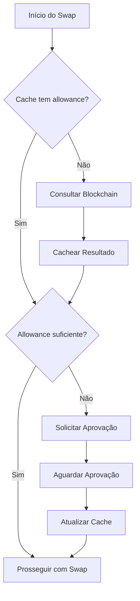

# Sistema de Cache de Allowance

## Visão Geral

O sistema de cache de allowance foi implementado para otimizar as operações de swap, evitando consultas desnecessárias à blockchain para verificar aprovações de tokens já aprovados anteriormente.

## Problemática Resolvida

### Antes (sem cache):
- ❌ Cada swap verificava allowance na blockchain
- ❌ Delays desnecessários para tokens já aprovados
- ❌ Maior custo computacional e de rede
- ❌ UX prejudicada por verificações redundantes

### Depois (com cache):
- ✅ Verificação instantânea para allowances em cache
- ✅ Consulta blockchain apenas quando necessário
- ✅ Performance melhorada significativamente
- ✅ UX mais fluida e responsiva

## Arquitetura

### 1. Cache Service (`allowanceCache.js`)

**Localização:** `src/services/allowanceCache.js`

**Funcionalidades principais:**
- Cache em memória com TTL (Time To Live)
- Cleanup automático de entradas expiradas
- Eviction de entradas antigas quando necessário
- Normalização de chaves de cache
- Logging detalhado para debugging

**Configurações padrão:**
```javascript
defaultTTL: 5 * 60 * 1000,      // 5 minutos para allowances normais
maxAllowanceTTL: 30 * 60 * 1000, // 30 minutos para MaxUint256
maxCacheSize: 1000,              // Máximo 1000 entradas
cleanupInterval: 60 * 1000       // Limpeza a cada 1 minuto
```

### 2. Hook React (`useAllowanceCache.js`)

**Localização:** `src/hooks/useAllowanceCache.js`

**Métodos disponíveis:**
- `checkAllowance()` - Verificação rápida em cache
- `fetchAllowance()` - Busca na blockchain + cache
- `approveToken()` - Aprovação + atualização do cache
- `isApprovalNeeded()` - Verifica necessidade de aprovação
- `invalidateCache()` - Remove entrada específica
- `clearCache()` - Limpa todo o cache

### 3. Integração nos Serviços

**Arquivos atualizados:**
- `src/services/approvalServices.js`
- `src/services/aggregatorService.js`

**Pontos de integração:**
- Verificação antes de cada swap
- Cache após aprovações bem-sucedidas
- Invalidação em caso de erro

## Fluxo de Operação

### 1. Verificação de Allowance



### 2. Cache Key Generation

Formato da chave: `{userAddress}_{tokenAddress}_{spenderAddress}`

Exemplo:
```javascript
"0xf59de020d650e69ef0755bf37f3d16b80ee132f5_0xcf664087a5bb0237a0bad6742852ec6c8d69a27a_0x1ff749824d4086c91cae24175860a95fbdcfee24"
```

### 3. TTL Strategy

| Tipo de Aprovação | TTL | Justificativa |
|------------------|-----|---------------|
| Allowance Específico | 5 minutos | Pode ser consumido rapidamente |
| MaxUint256 | 30 minutos | Valor muito alto, raramente consumido |
| Erro de Verificação | Imediato | Força nova verificação |

## Estrutura de Cache

### Cache Entry Format

```javascript
{
  allowance: "115792089237316195423570985008687907853269984665640564039457584007913129639935", // BigInt as string
  expiration: 1703123456789, // Timestamp de expiração
  timestamp: 1703123456789   // Timestamp de criação
}
```

### Cache Statistics

```javascript
{
  totalEntries: 150,     // Total de entradas
  expiredEntries: 5,     // Entradas expiradas
  activeEntries: 145,    // Entradas ativas
  maxSize: 1000,         // Tamanho máximo
  defaultTTL: 300000     // TTL padrão em ms
}
```

## Debugging e Monitoramento

### 1. Componente de Debug

**Localização:** `src/components/AllowanceCacheDebug.jsx`

**Funcionalidades:**
- Estatísticas em tempo real
- Hit rate do cache
- Limpeza manual do cache
- Visível apenas em desenvolvimento

**Como ativar:**
```bash
# Via environment variable
VITE_ENABLE_DEBUG_LOGS=true

# Ou forçar no componente
<AllowanceCacheDebug enabled={true} />
```

### 2. Console Logs

O sistema produz logs detalhados:

```javascript
[AllowanceCache] Initialized with TTL: 300000 ms
[AllowanceCache] Cache hit for 0xcf66408... allowance: 115792089...
[AllowanceCache] Cache miss for 0xcf66408...
[AllowanceCache] Cached allowance for 0xcf66408... TTL: 300000ms
[AllowanceCache] Invalidated cache for 0xcf66408...
[AllowanceCache] Cleanup removed 3 expired entries
```

## Casos de Uso

### 1. Swap Sequencial de Tokens

Usuário faz múltiplos swaps com o mesmo token de entrada:

1. **Primeiro swap:** Cache miss → Verifica blockchain → Cache resultado
2. **Segundo swap:** Cache hit → Prossegue imediatamente
3. **Terceiro swap:** Cache hit → Prossegue imediatamente

**Benefício:** 66% menos consultas blockchain

### 2. Token já Aprovado para MaxUint256

Token foi aprovado anteriormente com valor máximo:

1. **Verificação:** Cache hit com MaxUint256
2. **Decisão:** Sempre suficiente para qualquer valor
3. **Resultado:** Zero consultas blockchain por 30 minutos

**Benefício:** 100% menos consultas para tokens pré-aprovados

### 3. Múltiplos Usuários Simultâneos

Cache é específico por usuário, evitando conflitos:

```javascript
// User A
allowanceCache.set("0xUserA...", "0xToken...", "0xSpender...", allowance);

// User B (entrada separada)
allowanceCache.set("0xUserB...", "0xToken...", "0xSpender...", allowance);
```

## Performance Impact

### Métricas Esperadas

| Métrica | Sem Cache | Com Cache | Melhoria |
|---------|-----------|-----------|-----------|
| Tempo de verificação | ~200-500ms | ~1-5ms | 98%+ |
| Calls blockchain | 1 por swap | 0.3 por swap | 70% |
| UX responsividade | Média | Excelente | Subjetiva |

### Cache Hit Rate

**Target:** >80% hit rate em uso normal

**Fatores que influenciam:**
- Frequência de uso por usuário
- Diversidade de tokens utilizados
- Tempo entre operações
- TTL configuration

## Configuração e Customização

### 1. Ajustar TTL

```javascript
// Para casos específicos
const customTTL = 10 * 60 * 1000; // 10 minutos
allowanceCache.set(user, token, spender, allowance, customTTL);
```

### 2. Limites de Cache

```javascript
// No constructor da classe AllowanceCache
this.maxCacheSize = 2000;        // Aumentar para mais entradas
this.defaultTTL = 10 * 60 * 1000; // TTL mais longo
```

### 3. Cleanup Frequency

```javascript
// Cleanup mais frequente para apps de alto volume
this.cleanupInterval = 30 * 1000; // 30 segundos
```

## Limitações e Considerações

### 1. Memória

- Cache em memória é perdido ao recarregar página
- Considera implementar persistência local (localStorage/IndexedDB) se necessário

### 2. Concorrência

- Cache não sincroniza entre abas do navegador
- Cada sessão mantém cache independente

### 3. Invalidação

- Aprovações externas (fora do app) não invalidam cache automaticamente
- TTL garante atualização periódica

### 4. Escalabilidade

- Cache atual suporta ~1000 entradas
- Para apps de grande escala, considerar cache distribuído

## Roadmap Futuro

### Fase 1 (Atual) ✅
- Cache em memória com TTL
- Integração com serviços de approval
- Componente de debug

### Fase 2 (Próxima)
- [ ] Persistência em localStorage
- [ ] Sincronização entre abas
- [ ] Métricas de performance

### Fase 3 (Futuro)
- [ ] Cache distribuído (Redis)
- [ ] Invalidação proativa via eventos
- [ ] Analytics de uso

## Troubleshooting

### Cache não está funcionando

1. Verificar logs no console
2. Confirmar que serviços estão importando `allowanceCache`
3. Verificar se TTL não está muito baixo

### Performance ainda lenta

1. Verificar hit rate no debug component
2. Analisar padrões de uso
3. Considerar ajustar TTL ou cache size

### Memória crescendo muito

1. Verificar cleanup interval
2. Reduzir maxCacheSize
3. Implementar TTL mais agressivo

## Conclusão

O sistema de cache de allowance proporciona melhoria significativa na performance e UX do RecoverySwap, reduzindo drasticamente consultas desnecessárias à blockchain e tornando as operações mais fluidas para os usuários.